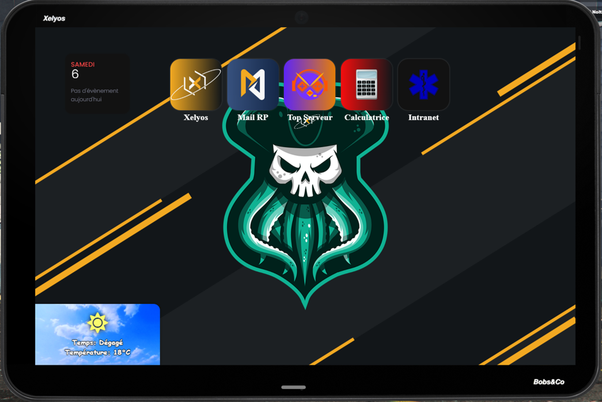

# XelBob-tab

**XelBob-tab** is a script created in collaboration with the **[Xelyos](https://xelyos.fr/discord)** team. The aim of this script is to display websites directly on your server. You have the ability to configure multiple websites to be displayed and restrict access based on the player's job, thereby adding a realistic dimension to your server.

Furthermore, **XelBob-tab** offers an optional feature: real-time weather display on the in-game tablet. This functionality is only accessible when using the easytime script

---

## Installation

To access the installation and configuration protocol, please visit the website: [Xelyos Wiki](https://wiki.xelyos.fr/books/xelbob-tab/page)
Pour accéder au protocole d'installation et de configuration, rendez vous sur le site : [Xelyos Wiki](https://wiki.xelyos.fr/books/xelbob-tab/page)

## Requirement

* [cd_easytime](https://github.com/dsheedes/cd_easytime) (optional)

# Preview

